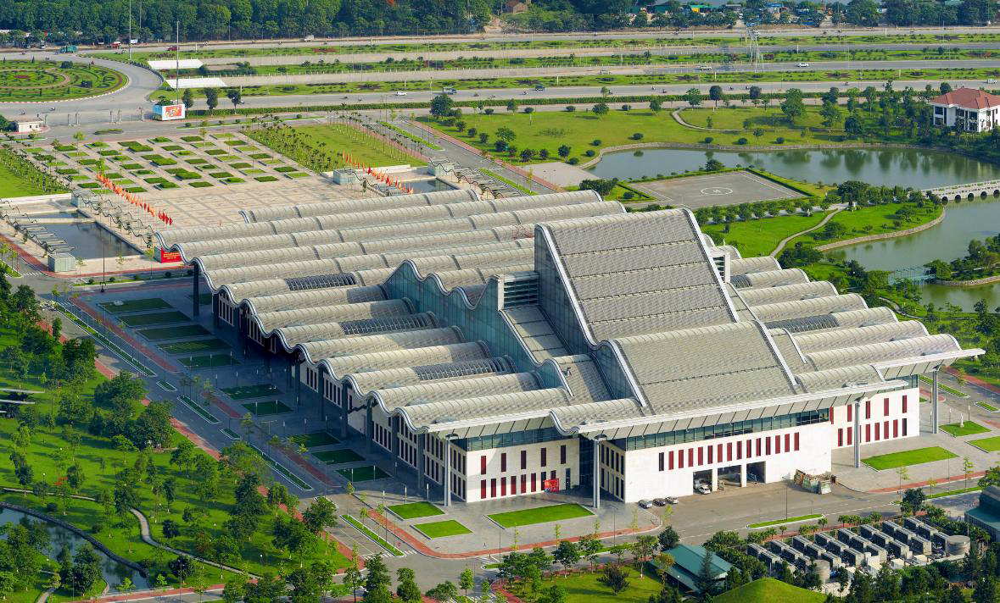

<h1 style="color: #f15c21;">VENUES </h1> 

# 1. VinUniversity
 The primary venue of the 16th Asian Conference on Machine Learning is VinUniversity, located in Vinhomes Ocean Park, Hanoi, Vietnam. With only a 19% building density and with 117 hectares dedicated to trees and natural areas, the campus will be an ideal setting for self-directed and collaborative learning, peaceful introspection, and inspirational beauty.
The landscape, architecture, and interior at VinUniversity deliver the optimal learner-centered environment. Lecture halls and classrooms is designed to enable a highly flexible and adaptable active learning environment.

# 2. National Convention Center
The National Convention Center is a co-venue for ACML2024, held alongside the 17th Asian Conference on Computer Vision <https://accv2024.org/>.
Situated on Thăng Long Boulevard in Nam Từ Liêm district, it is a major convention center of the capital of Vietnam. With a total area of over 60,000 square meters, the NCC is equipped with state-of-the-art facilities, capable of hosting international conferences, exhibitions, and high-profile events. Its design reflects harmony between modernity and nature, featuring large glass facades that allow natural light to fill the expansive halls, as well as landscaped gardens surrounding the complex.

# 3. Vietnam National Museum of History
The ACML2024 Welcome Reception is tentatively scheduled to take place at the Vietnam National Museum of History, a prestigious venue located in Hanoi’s historic Hoan Kiem district. This iconic museum offers a unique journey through Vietnam’s rich cultural and historical heritage, housing an impressive collection of over 200,000 documents and artifacts. Spanning from prehistoric times to the modern era, the museum provides a comprehensive look at the nation's evolution. Therefore, it is not just a place to appreciate history, but also to experience the heart of Vietnam's cultural identity.
For more information about the place, please visit <https://baotanglichsu.vn/en>

# 4. Hanoi Tower
Hanoi Tower is honored to be the venue for ACML2024 Gala dinner, providing a stunning setting in one of the city’s most prestigious developments. This iconic twin-tower complex is a landmark of modern design and convenience. The venue is situated in the heart of Hanoi’s Central Business District at 49 Hai Ba Trung Street, offering easy access to key government and commercial offices, as well as a range of amenities such as banks, supermarkets, and entertainment hotspots. With its prime location, sleek architecture, and seamless blend of business and leisure, Hanoi Tower offers an elegant and vibrant atmosphere, ensuring a memorable experience for ACML2024 attendees.

