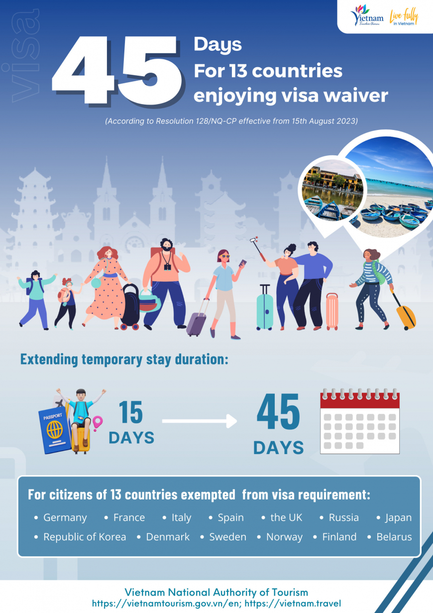
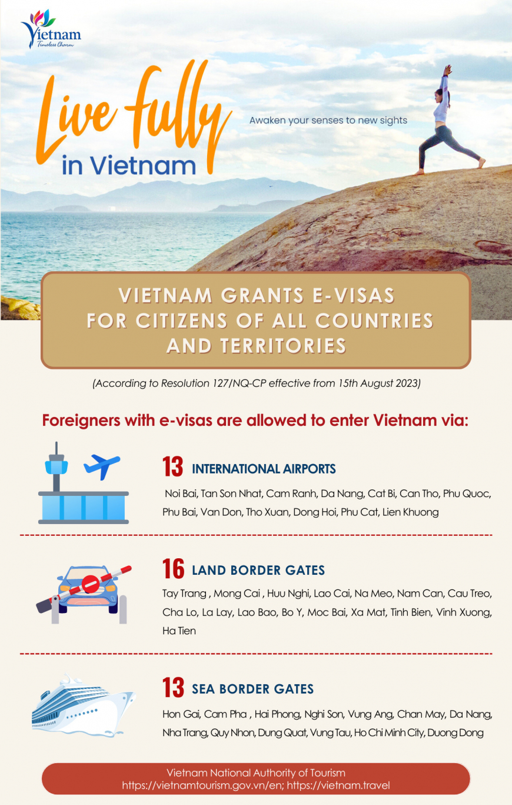

<h2 style="color:red;">Visa Exemptions </h2> 

Vietnam's new visa policy effective from 15th August 2023 extends stay duration for 13 countries enjoying unilateral visa exemption from 15 days to 45 days, regardless of passport type and entry purpose. The 13 coutries include: Germany, France, Italy, Spain, the UK, Russia, Japan, Republic of Korea, Denmark, Sweden, Norway, Finland and Belarus.

<h3>Below is the full list of 25 countries +Kazakhstan that are exempted from visa requirement:</h3>

Brunei, Myanmar, Belarus, Denmark, Finland, France, Germany, Italy, Japan, Norway, Russia, South Korea, Spain, Sweden, The UK, The Philippines, Cambodia, Indonesia, Kyrgyzstan, Laos, Malaysia, Singapore, Thailand, Chile, Panama.

<h2 style="color:red;">VIETNAM ELECTRONIC VISA (E-VISA)  </h2>
From 15th August 2023, Vietnam grants e-visas for citizens of all countries and territories with 90-day stay duration and valid for multiple entry.

<strong>Simply <a href="https://evisa.xuatnhapcanh.gov.vn/en_US/web/guest/khai-thi-thuc-dien-tu/cap-thi-thuc-dien-tu">apply online for your tourist E-visa</a>. You will receive your code by email to print your visa or access via official website of the <a href="https://evisa.xuatnhapcanh.gov.vn/en_US/tra-cuu-thi-thuc">Vietnam Immigration Department.</a></strong>

<!-- <strong> 13 international airports: </strong> Noi Bai (Ha Noi), Tan Son Nhat (Ho Chi Minh City), Cam Ranh (Khanh Hoa), Da Nang, Cat Bi (Hai Phong), Can Tho, Phu Quoc (Kien Giang), Phu Bai (Thua Thien Hue), Van Don (Quang Ninh), Tho Xuan (Thanh Hoa), Dong Hoi (Quang Binh), Phu Cat (Binh Dinh), Lien Khuong (Lam Dong).

<strong> 16 land border gates: </strong> Tay Trang (Dien Bien), Mong Cai (Quang Ninh), Huu Nghi (Lang Son), Lao Cai, Na Meo (Thanh Hoa), Nam Can (Nghe An), Cau Treo (Ha Tinh), Cha Lo (Quang Binh), La Lay and Lao Bao (Quang Tri), Bo Y (Kon Tum), Moc Bai and Xa Mat (Tay Ninh), Tinh Bien and Vinh Xuong (An Giang), Ha Tien (Kien Giang).

<strong> 13 sea border gates: </strong> Hon Gai and Cam Pha (Quang Ninh), Hai Phong, Nghi Son (Thanh Hoa), Vung Ang (Ha Tinh), Chan May (Thua Thien Hue), Da Nang, Nha Trang (Khanh Hoa), Quy Nhon (Binh Dinh), Dung Quat (Quang Ngai), Vung Tau (Ba Ria - Vung Tau), Ho Chi Minh City, Duong Dong (Kien Giang). -->

 

<!-- 
To stay beyond this number of days, you may apply for a visa extension upon your arrival in Vietnam.

<h2>Notes on Visa Exemptions</h2> 
Citizens of the Federal Republic of Germany, the French Republic, the Italian Republic, the Kingdom of Spain, the United Kingdom of Great Britain and Northern Ireland, the Russian Federation, Japan, the Republic of Korea, the United Kingdom of Denmark, the Kingdom of Sweden, the Kingdom of Norway, the Republic of Finland and the Republic of Belarus entering Vietnam for a sojourn of 15 days, counting from the date of entry, regardless of their passport types and entry purposes, provided they meet all the conditions prescribed by Vietnam’s law. In addition, the policy on entry visa exemption for citizens of the above-mentioned countries shall be implemented for 3 years from March 15, 2022 to the end of March 14, 2025, and will be considered for an extension in accordance with Vietnam’s law.

<h2>Vietnam Electronic Visa (e-Visa)</h2>
Vietnam’s e-Visa is now available to nationals of 80 countries:

 
Step 1: Prepare the required materials: • One 4&#215;6 passport photo in .jpg format with a white background, without glasses. • One photo in .jpg format of your passport data page. • Passport valid for at least six months. • Your temporary address in Vietnam and points of entry and exit. • Debit or credit card for payment. Step 2: Click this link or access <https://immigration.gov.vn>{:target="_blank"} and go to &#8216;E-visa Issuance&#8217; then click on the link for &#8216;Outside Vietnam foreigners&#8217;. Step 3: Upload your .jpg images (passport data page and passport photo) and fill out the required fields on the form completely. Submit your form. Step 4: Pay the e-Visa fee of 25 USD. Copy down the document code provided. Step 5: Within three working days you should receive news of your e-Visa application via email. If not, you can also run a search for your e-Visa at this link. Step 6: Use your document code to locate your e-Visa online. Download and print the e-Visa in two copies for extra safety.
 
<i>&#8220;TIP: Travellers with an e-Visa can go directly to immigration counters at their point of entry and do not need to queue at Visa on Arrival counters.&#8221;</i>

<h2>Vietnam Visa on Arrival</h2>

If you are planning a multiple-entry visit or a stay of more than 30 days, you will want to apply for a visa on arrival. To do this you&#8217;ll need:

1. A 4&#215;6 passport photo with a white background and no glasses. 2. A filled-out visa application form. 3. A passport or substitute ID valid for six months from the date you plan to enter Vietnam. 4. Payment (25 USD to 50 USD) for visa fees, and 5. A Letter of Approval from a Vietnamese embassy or consulate (if you are picking up your visa at the airport). If you are near a Vietnamese embassy or consulate, you can submit your photo, application form, passport, and visa fee in person. This website will guide you through the process.

If you are unable to reach a Vietnamese embassy or are short on time, there are trusted services online that can provide you with a valid Letter of Approval for a fee. Bring this letter together with a visa application form and your other documents to the Visa on Arrival counter at the airport when you land.

<i>&#8220;TIP: You will need to pay your visa stamp fee in USD or Vietnamese Dong on arrival at the airport.&#8221;</i>

<b>The information above is compiled by the Vietnam National Administration of Tourism. 
</b> -->
