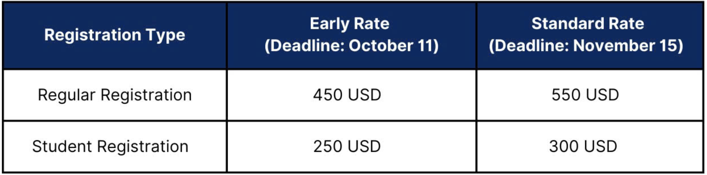

 <h1>Registration </h1>

Please read the information below carefully before registering. Kindly note that all deadlines are at <strong>23:59 AoE (Anywhere on Earth).</strong>

<h3>REGISTRATION FEE </h3>
The registration fee includes value-added tax (VAT) and credit card bank fees.

<h3> IMPORTANT NOTES </h3>

* Registration fee (both regular and student) includes access to tutorials, workshops, conference sessions, lunches, refreshment breaks, welcome reception, and conference banquet.
*	Student participants must show a valid student ID at the registration desk and provide details during registration.
*	An invoice and payment link for registration fee will be sent to the email address you provided during the online registration process.
*	General inquiries on conference registration can be sent to <acml_2024_registration@googlegroups.com>.

<h3>AUTHOR POLICY</h3>
Each accepted paper from either the conference or journal track must 
* (1) be presented at ACML 2024 to be published.
* (2) must have at least one author registered for the conference (either Regular Registration or Student Registration) by the early rate deadline.
* (3) No author can be registered for multiple papers.

<h3>BADGE POLICY</h3>
Access to all ACML activities will be granted only to individuals wearing ACML 2024 badges. Badges will not be reprinted or replaced if lost. If you lose your badge, you will need to purchase a new one at the current on-site registration rate. Please keep your badge with you and ensure you bring it each day.

<h3>REGISTRATION FORM </h3>
[ACML 2024 Registration Form](https://docs.google.com/forms/d/e/1FAIpQLSfwf4iBWsBJg8iMoF_ICYymJ775zjO3ngUHWKjJ5lILOrXeTg/viewform){:target="_blank"}

<h3>PAYMENT METHODS</h3> 
There are two forms of payment
* Credit card payment 
* TT Bank transfer 

<h3>1.	Credit card payment </h3>
* <strong>Step 1</strong>: After receiving your registration, the Organizing Committee will send you an invoice with a secure credit card payment link via the OnePay payment gateway. You will receive an email from <acml2024@goldentour.vn>.
* <strong>Step 2</strong>: A OnePay screen will display the amount you need to pay. Please fill in the required information and proceed to checkout.
* <strong>Step 3</strong>: Complete the payment process.

     * If you encounter a "Payment Failed" error while paying with your credit card, please try again at  <https://acml2024.goldentour.vn>  or contact Mr. Peter Pham, CEO of GoldenTour, at (+84) 967966777 or via email at <acml2024@goldentour.vn> / <peterpham@goldentour.vn>. 

    * You may combine the payment for registration fees and other costs, such as hotel booking deposits and travel expenses.

<h3>2.	TT Bank transfer</h3>
Bank transfer payments must be made to <strong>GOLDENTOUR BANK ACCOUNT</strong>, with bank charges borne by the payer.
* <strong>Step 1</strong>: After receiving your registration, the Organizing Committee will send you an invoice with the <strong>GOLDENTOUR BANK ACCOUNT</strong> details and Swift code. You will receive an email from <acml2024@goldentour.vn>.
* <strong>Step 2</strong>: Transfer the correct amount to <strong>GOLDENTOUR BANK ACCOUNT</strong>, including the Swift code. Be sure to include the transaction description (ACML 2024 - Registrant's Full Name - Paper ID), and pay the exact amount listed in the registration form.
* <strong>Step 3</strong>: Take a screenshot of the transaction and send it to  <acml2024@goldentour.vn>.
<h3> CANCELLATION POLICY </h3>
* No refunds will be provided unless a cancellation request is sent to <acml_2024_registration@googlegroups.com> by December 1st, 2024. All refunds are subject to a 25% cancellation fee. Authors who have registered cannot cancel.
* Refunds will not be processed on-site.

